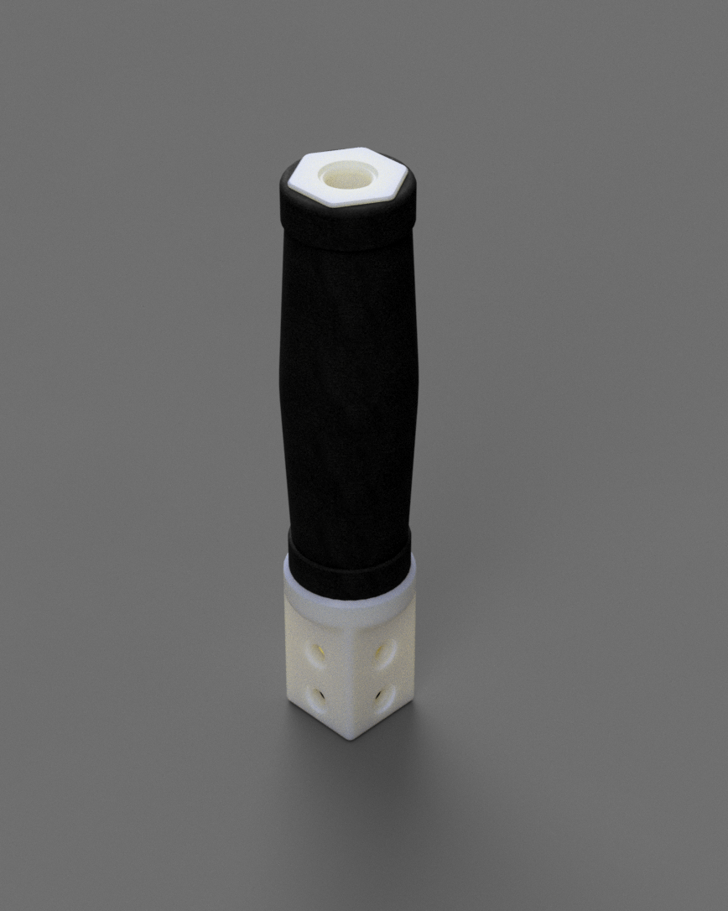

# Bushplane add-on

## Basic grip

This add-on is a very basic “bushplane” style grip for the gimbal. This simulates a single button grip used in small aircraft and gliders.

It uses a single common 12mm push button.

Wiring requires using the extra IO pins on the PCB (AUX_BTN_1_2) and the exact wiring differs with freejoy builds (which is BTN1 and GND) or arduino micro (BTN1 and BTN2)

The foam grip is a standard 34x125mm long EVA foam bicycle grip. The cap on the top threads on with printed threads. 
