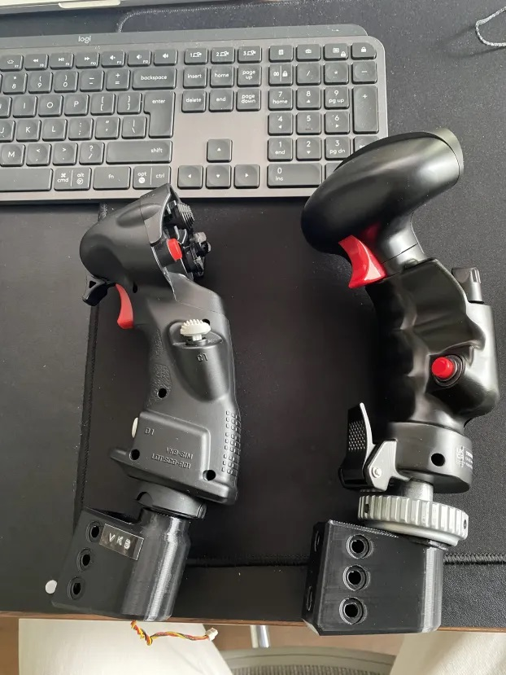

# Community add-ons or modified parts 

Here is a directory to community submitted add-ons or modifications of the base parts

## McDinggle

### TM_Adapter_short.stl & VKB_Adapter.stl

McDinggle has contributed these modifed parts, first a TM adapter that has less threads to shorten the overall length of the adapter and a modified adapter for attaching a NXT Gladiator grip. 
The method for reading inputs from the VKB is still being researched.

