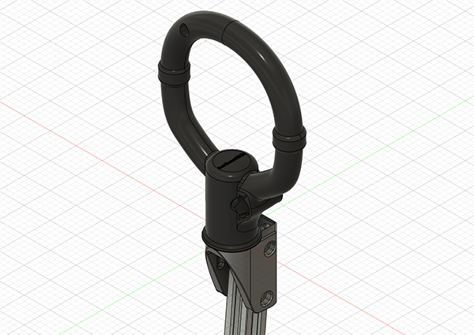

# Community add-ons or modified parts 

Here is a directory to community submitted add-ons or modifications of the base parts

## McDinggle

### TM_Adapter_short.stl & VKB_Adapter.stl

McDinggle has contributed these modifed parts, first a TM adapter that has less threads to shorten the overall length of the adapter and a modified adapter for attaching a NXT Gladiator grip. 
The method for reading inputs from the VKB is still being researched.

## Authentikit

### Spitfire spadegrip adapter

Using the excellent https://authentikit.org/ 3d printable flight controls, you can print the upper piece of the Spitfire MkIX spade grip https://download.authentikit.org/filebase/index.php?file/3-spitfire-mkix-starter-kit-a/ and attach it to the 2020 aluminum extrusion directly. The grip is tilted 5 degrees forward to emulate the real "center" angle of the spadegrip. 

For connecting the buttons and brake axis, it is recommended to use the freejoy configuration and connect to the added IO pins (DIRECT_BUTTON_IO).

