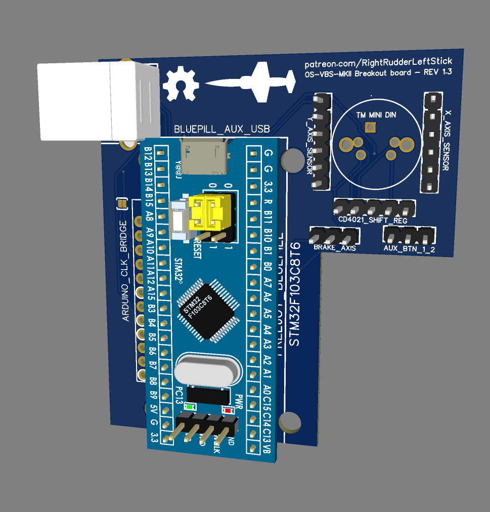
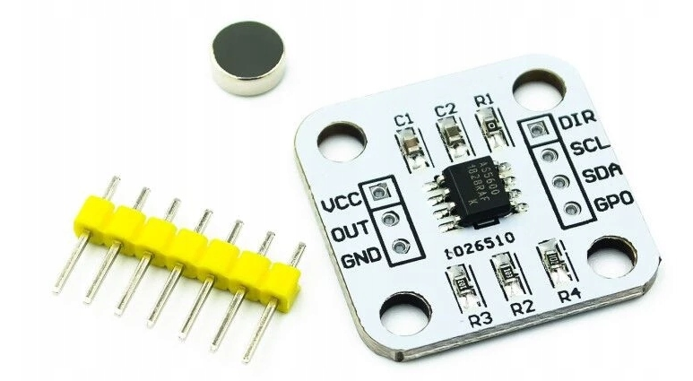
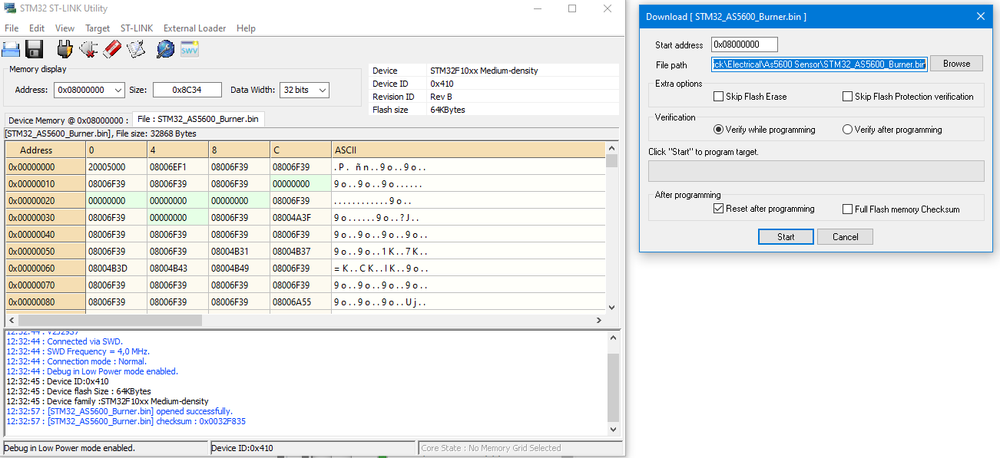
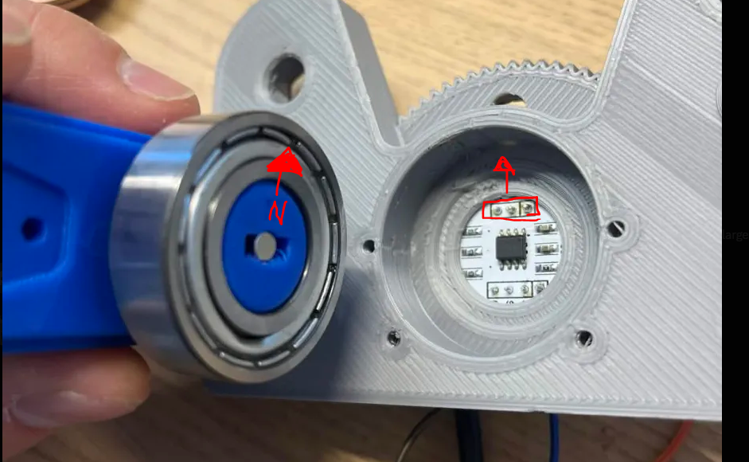
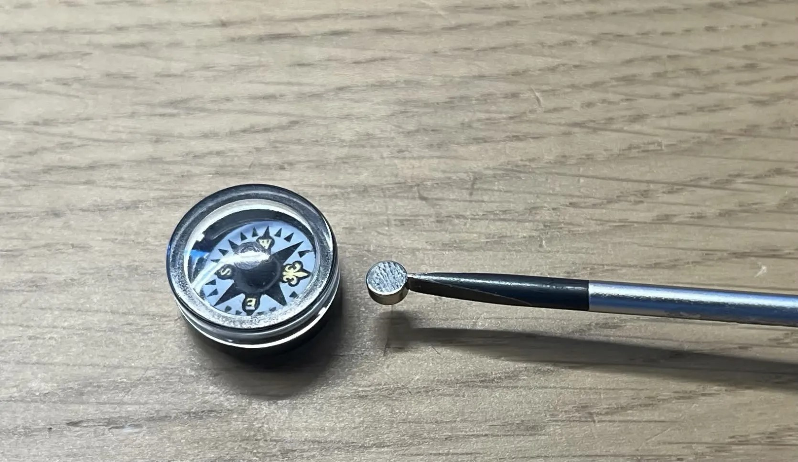

# Firmware for microcontrollers

## Breakout Board

The breakout board is designed to socket either a STM32F103C8 microcontroller board (freejoy) or an Arduino Pro Micro (MMJOY2 or custom code). You can use the gerber file to order the PCB from your local assembler, or order directly from PCBWAY [here](https://www.pcbway.com/project/shareproject/Open_Source_Very_Large_Stick_Freejoy_MMjoy2_breakout_board_f66f472f.html).

Current Revision is 1.5

## MMJOY2 version

The MMJOY2 variation will require an Andruino Pro Micro, and the solder bridge must be connected on the PCB to set it for this configuration.

This is the public directory of all the version of MMJOY2 that were released before the project was halted.

Link to [website.](https://sites.google.com/site/mmjoyproject/%D1%84%D0%B0%D0%B9%D0%BB%D1%8B-%D0%B4%D0%BB%D1%8F-%D1%81%D0%BA%D0%B0%D1%87%D0%B8%D0%B2%D0%B0%D0%BD%D0%B8%D1%8F) 

For best reliabilty and compatibility with the included .mmjoy2 file. Use MMJOY2[v20160818upd1].rar

## Freejoy version

Using the freejoy version requires a **genuine** STM32F103C8 microcontroller board. Counterfeit STM32 chips cause all sorts of unpredictable problems with the Freejoy firmware. Try and order your STM32F103C8 from a trusted retailer with a proper return policy. 

Freejoy version requires a specialized firmware on top of v1.7.1_1b3 that is publically avaliable. Due to the length of the stick and wiring the timing of the CD4021 shift registers causes ghosting of inputs. This specialized firmware adjusts this. It is in the /Firmware/ directory.

In the /config/ directory there is also the w.i.p config file. It doesn't yet support the new IO pins of the 1.4 board revision.

Link to Freejoy [github.](https://github.com/FreeJoy-Team/FreeJoy)

## AS5600 Sensor Option

Because of supply chain issues, the EOL of the TLE5011 sensor, tariffs, some regions not having aliexpress, I've decided to support the very common AS5600 encoder sensor on the white breakout board. 

The AS5600 is extremely common, as its used as an encoder on motors. The problem is its range is a full 360 degrees, which means for the 37 degrees we actually use that's only 440 steps of sensitivity over the range, which is reduced even more if you have a noisy signal.

I've created a script that can run on the bluepill before flashing freejoy that uses the internal chip register to instead convert the 360 range to a much narrower 50 degrees. This is a permanent "burn" operation into the chips memory. What it does is take the 360 degree range and truncate it to 245 - 290 degrees, which now will respond with 0-3.3v over the analog out, massively improving the sensors sensitivity. What this means is mounting the small magnet is extremely important to get within 10 degrees of north orientation, as we have 50 degrees to fit the 37 degrees of actual axis movement.

Here is the pin out guide to setting up the ship programmer.

BLUEPILL | 3.3v | GND | B6 | B7 | 
--- | --- | --- | --- | --- |
AS5600  | VCC | GND | SCL | SDA |

You load the [STM32_AS5600_Burner.bin](https://github.com/RightRudderLeftStick/OpenSource-VeryBigStick/tree/main/Electrical/As5600%20Sensor) with the ST-link utility just like how you flash the freejoy firmware for the first time. 

Then while the board is powered from the ST-link v2 and connected to the AS5600 board, take a wire connected to the A1 pin on the bluepill and touch it to the extra GND pin on the bluepill. The LED on the board should flash 3 times and the 0-360 degree range of the sensor is now permamently burned to 245-295 degrees. So now over these 50 degrees the analog pins will output 0-3.3v range.

Now you use the analog pins of the AS5600 as you would a pot or other hall effect sensor.

When you place the AS5600 white breakout board into the holder, align the 3 analog pins in the same direction as the North of the magnet as pictured here. In the gimbal and the pedals is different, as the magnet holder slot is at different orientations for printablity. 

Note that this mechanism only allows around 37 degrees of moment, which means the small magnet can have only 13 degrees of misalignment. Use the edge of a very fine flat screwdriver to align the north pole directly with the N printed on the pin. Use a compass to verify that it is in fact the north pole. Test the axis before fully assembling to make sure you are not hitting the edge of the range during normal movement. If you get the N and S poles flipped, you can also rotate the white board 180 degrees in the mount.
