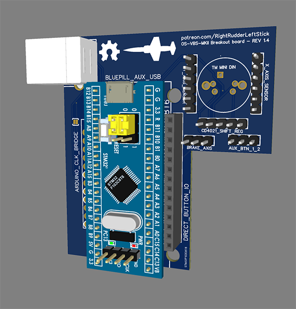

# Firmware for microcontrollers

## Breakout Board

The breakout board is designed to socket either a STM32F103C8 microcontroller board (freejoy) or an Arduino Pro Micro (MMJOY2 or custom code). You can use the gerber file to order the PCB from your local assembler, or order directly from PCBWAY [here](https://www.pcbway.com/project/shareproject/Open_Source_Very_Large_Stick_Freejoy_MMjoy2_breakout_board_f66f472f.html).

Current Revision is 1.4

## MMJOY2 version

The MMJOY2 variation will require an Andruino Pro Micro, and the solder bridge must be connected on the PCB to set it for this configuration.

This is the public directory of all the version of MMJOY2 that were released before the project was halted.

Link to [website.](https://sites.google.com/site/mmjoyproject/%D1%84%D0%B0%D0%B9%D0%BB%D1%8B-%D0%B4%D0%BB%D1%8F-%D1%81%D0%BA%D0%B0%D1%87%D0%B8%D0%B2%D0%B0%D0%BD%D0%B8%D1%8F) 

For best reliabilty and compatibility with the included .mmjoy2 file. Use MMJOY2[v20160818upd1].rar

## Freejoy version

Using the freejoy version requires a **genuine** STM32F103C8 microcontroller board. Counterfeit STM32 chips cause all sorts of unpredictable problems with the Freejoy firmware. Try and order your STM32F103C8 from a trusted retailer with a proper return policy. 

Freejoy version requires a specialized firmware on top of v1.7.1_1b3 that is publically avaliable. Due to the length of the stick and wiring the timing of the CD4021 shift registers causes ghosting of inputs. This specialized firmware adjusts this. It is in the /Firmware/ directory.

In the /config/ directory there is also the w.i.p config file. It doesn't yet support the new IO pins of the 1.4 board revision.

Link to Freejoy [github.](https://github.com/FreeJoy-Team/FreeJoy)
