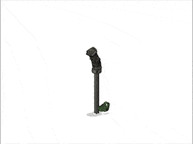
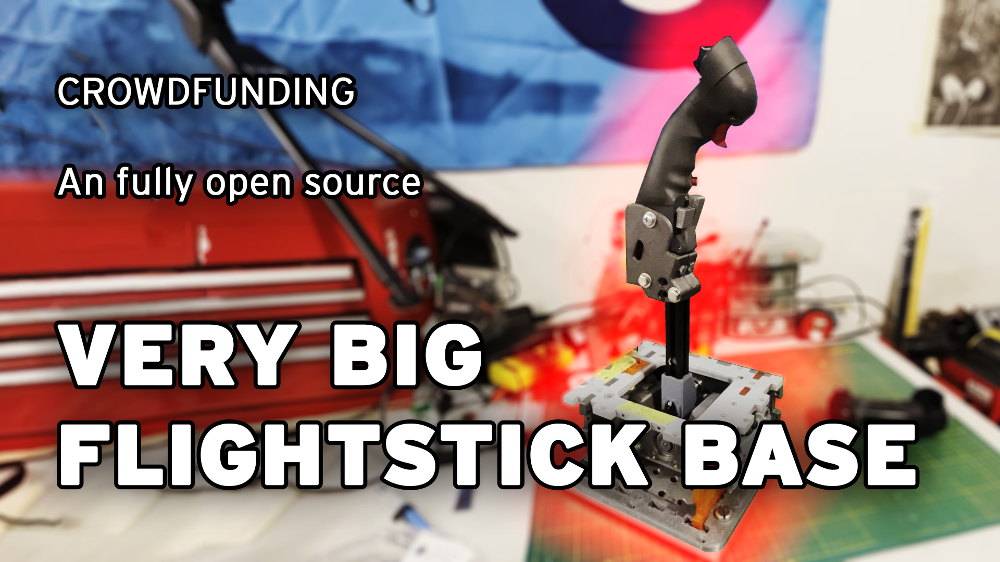
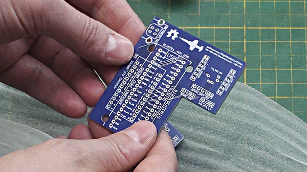
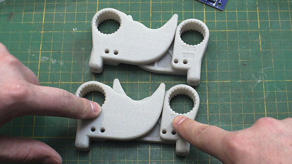
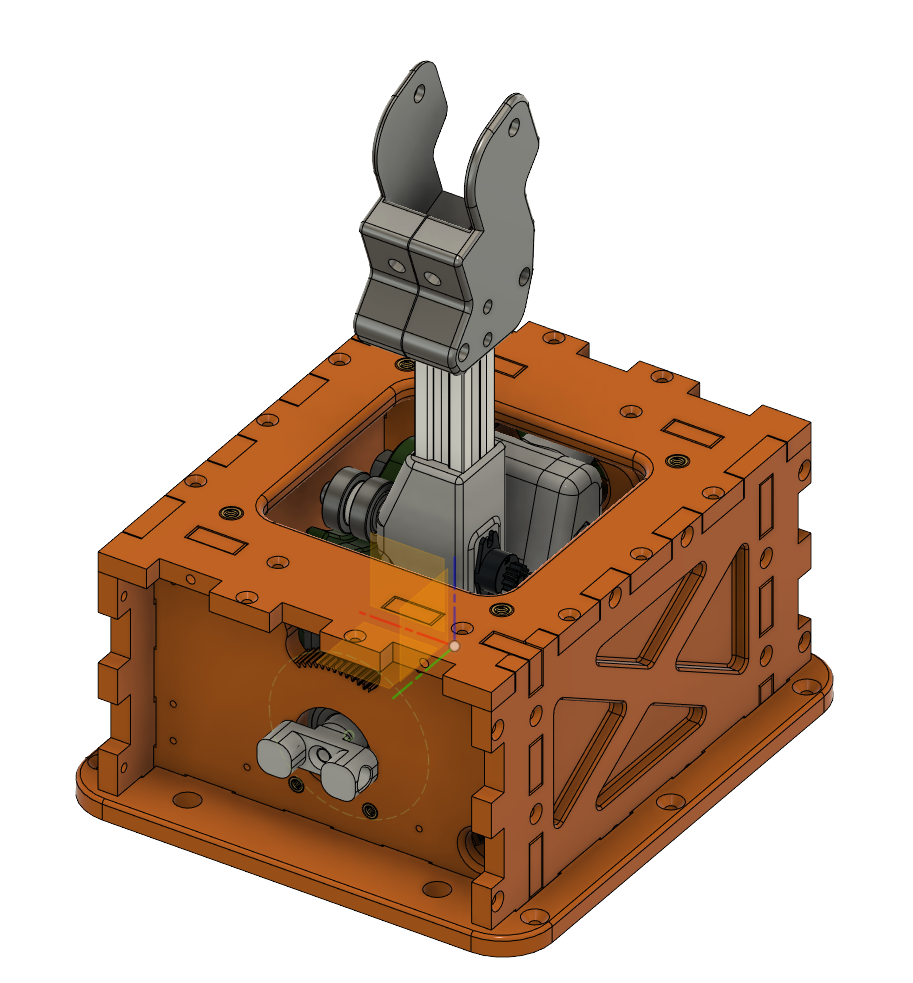

# OPEN SOURCE VERY BIG STICK PROJECT 2024
A very large joystick gimbal for very big sticks!

This totally open source gimbal is designed for end users to either connect existing Thrustmaster compatibable grips or attach any custom grip directly to the base. It supports very high spring forces allowing for very realistic feeling flight controls.

It is recommended all parts are printed in PETG, while PLA+ may be acceptable for all parts other than the CAMS, which can be ordered from 3D printed providers in very durable materials.

Checkout the PDF file in the repo to see the bill of materials and the print orientation guide. 

## The current version is Beta 1.3

Check out this build guide below to learn how to assemb the base gimbal!

This video shows on to connect the electrical wiring.

## Patreon
Follow the progress at my patreon. Subscribers recieve early indevelopment F3D project files and other exclusive updates:

## PCBWAY

You can also order the breakout PCB directly from PCBWAY, as well as the CAMs to print in Glass fibre Nylon for extra durability and quality than what can be done on most home printers.

### ORDER LINKS FOR PCBWAY
[PCB boards](https://www.pcbway.com/rapid-prototyping/manufacture/)

**CAMS** 
(4 are required for a complete set. Order in Glass Fibre Nylon)

[Soft Cam](https://www.pcbway.com/rapid-prototyping/manufacture/)

[Medium Cam](https://www.pcbway.com/rapid-prototyping/manufacture/)

[Hard Cam](https://www.pcbway.com/rapid-prototyping/manufacture/)

## Partner Projects.

Please Checkout TheSimNet's Youtube Channel. He releases designs of fully 3D printable flight grips with TM compatbility. All the renders of the OS-VBS-MK2 use his Free B-8 Grip models for reference. He also sells really cool projects like a very accurate F-15C grip. 

## Changelog

### 1.3

- Updated with electrical gerber files for the breakout board
- New TM adapter piece that has an offset for use with common chairs
- Revisions to several pieces, including a new "PitchFrame_TopPlate" that includes extra M5 holes for the future cyclic piston damper upgrade and cut outs to make it easier to fit a socket wrench into the gimbal to change cams
- Added Add-on for office chair mount
- Added the configuration file for MMJOY2
- Adjusted the PitchFrame_PillowBlock.3mf to have wider holes for feeding the wires through.
- Redesigned the CAMs to not require the Cam_Bearing_washer.3mf and to nicely friction fit the 608 bearings with compliance holes.

### 1.2
- Revised the TM adapter piece to have the clearance for the X shape at the bottom of the TM grip connector

### 1.1

- Fix to the TM adapter to add a second set of holes.

### 1.0

- Intial release of the mechanical parts of the gimbal, as seen in the mechanical guide video.

---

[This project is licensed as CC BY-SA 2.0](https://creativecommons.org/licenses/by-sa/2.0/)
