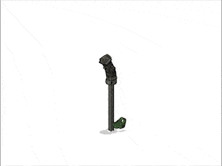
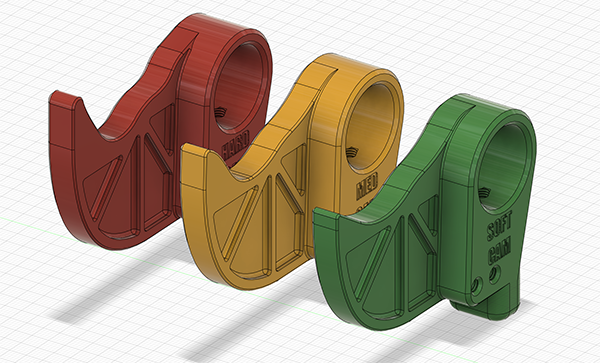
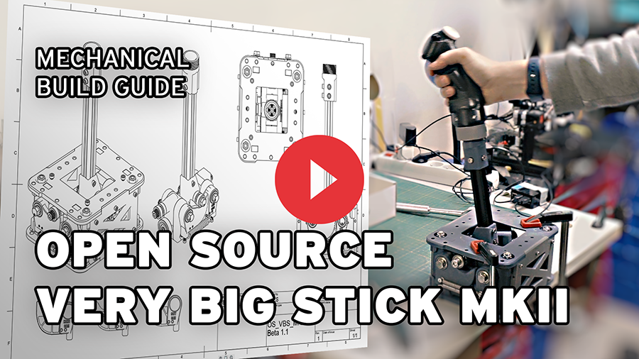
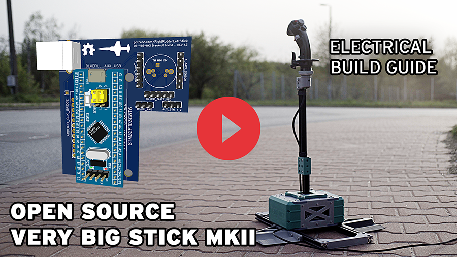
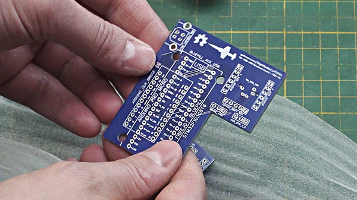
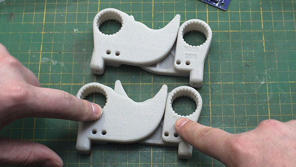
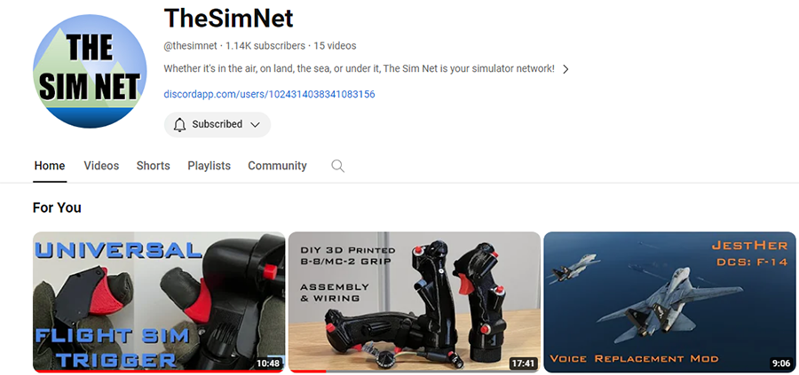
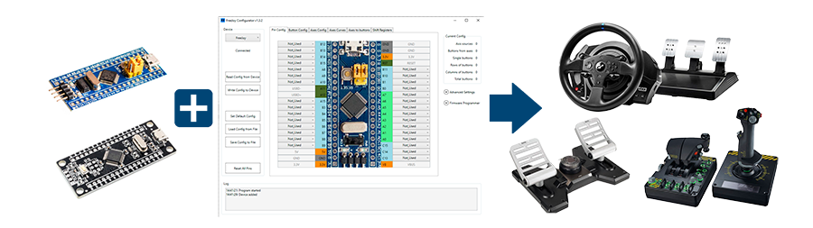
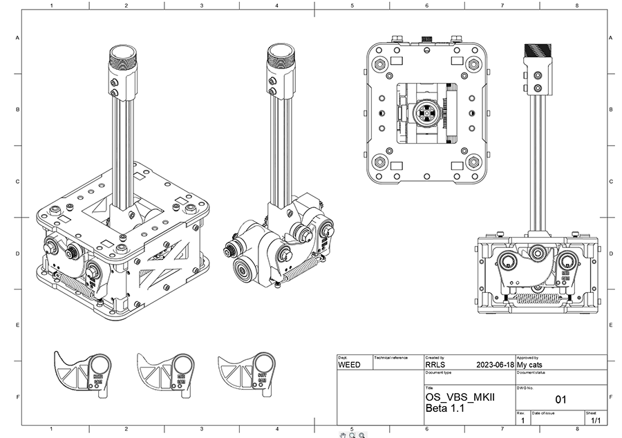

# OPEN SOURCE VERY BIG STICK PROJECT 2025
A very large joystick gimbal for very big sticks!

This totally open source gimbal is designed for end users to either connect existing Thrustmaster compatible grips or attach any custom grip directly to the base. It supports very high spring forces allowing for very realistic feeling flight controls.

It is recommended all parts are printed in PETG, while PLA+ may be acceptable for all parts other than the CAMS, which can be ordered from 3D printed providers in very durable materials.

Checkout the PDF file in the repo to see the bill of materials and the print orientation guide. 

## The current version is Beta 1.3.6

For printing CAMs, it is recommended for "jet" style flying with a full length extension (office chair height) to use "HARD_CAMS" and for medium length (seated low in a sim pit) to use "MED_CAMS". The use of "SOFT_CAMS" is only recommended for warbirds (WWII prop aircraft) or helicopters.

Check out this build guide below to learn how to assemble the base gimbal!

This video shows on to connect the electrical wiring and assemble the office chair mount.

## Patreon
Follow the progress at my patreon. Subscribers recieve early indevelopment F3D project files and other exclusive updates:

## PCBWAY

You can also order the breakout PCB directly from PCBWAY, as well as the CAMs to print in Glass fibre Nylon for extra durability and higher quality than what can be done on most home printers.

### ORDER LINKS FOR PCBWAY
[PCB boards](https://www.pcbway.com/project/shareproject/Open_Source_Very_Large_Stick_Freejoy_MMjoy2_breakout_board_f66f472f.html)

**CAMS** 
(4 are required for a complete set. Order in Glass Fibre Nylon)

[Soft Cam](https://www.pcbway.com/project/shareproject/Open_Source_Very_Large_Stick_SOFT_CAM_c2835ecf.html)

[Medium Cam](https://www.pcbway.com/project/shareproject/Open_Source_Very_Large_Stick_MEDIUM_CAM_0f6965ab.html)

[Hard Cam](https://www.pcbway.com/project/shareproject/Open_Source_Very_Large_Stick_HARD_CAM_c53480e9.html)

## Partner Projects

### TheSimNet

Please Checkout TheSimNet's Youtube Channel. He releases designs of fully 3D printable flight grips with TM compatbility. All the renders of the OS-VBS-MK2 use his Free B-8 Grip models for reference. He also sells really cool projects like a very accurate F-15C grip. 

### Freejoy

Freejoy is an excellent open source alternative to MMjoy2 and is great for creating for really low cost and powerful USB game controller devices.... if you can still find genuine STM32 boards. 

Link to Freejoy [github.](https://github.com/FreeJoy-Team/FreeJoy)

# Changelog

### 1.3.6
- Added a TPU_Boot.3mf which is a printable TPU cover to go over the top of the gimbal to keep dust and debris out of the mechanism. Print slowly as there are 60 degree overhangs in the design.

### 1.3.5
- Added the OuterCamCover_FreejoyUSB.3mf which has a port for the USB-B port when using freejoy to stick out. a regular USB cable connected directly to the bluepill or ardiuno can also go through this hole with a strain relief plate attached with M3 screws

### 1.3.4
- Added the sideplate.3mf. These just snap over the sides of the gimbal that are open to cover them.
- Added the authentikit Spade grip adapter, see community add-ons directory.
- Modified the wheel chocks and crossbar pieces to have 1.5mm of height from the floor. This raises the aluminum extrusions so the edges don't scratch hardwood floors. This also will be for heigh compatiblity with the rudder pedals which will also have the 1.5mm of space.

### 1.3.3
- Added the bushplane grip as an optional single button handle for the gimbal. included in the BushPlane_Grip directory.
- Added a new restrictor plate called "CYC_Split_RestrictorPlate_20degrees.3mf" that replaces the original 3mf of the restrictor plate. It comes in two parts and allows itself to be removed or replaced without diassembling the stick column

### 1.3.2a

- Fixed a net error in the PCBbreakout board (now revision 1.5) which required reordering the IO buttons on the breakout.

### 1.3.2

- Fixed an error in the breakout board where the TM mini DIN had the wrong pin orientation. 
- Fixed mislabelling on the USB breakout pins.
- Added 13 extra button IO pins to the breakout board. Now using freejoy a B-8 style grip can have all the buttons wired directly without using a shift register.

### 1.3.1

- Fixed the quantity in the build guide for "2020_Crossbar.3mf" from 1 to 2.

### 1.3

- Updated with electrical gerber files for the breakout board
- New TM adapter piece that has an offset for use with common chairs
- Revisions to several pieces, including a new "PitchFrame_TopPlate" that includes extra M5 holes for the future cyclic piston damper upgrade and cut outs to make it easier to fit a socket wrench into the gimbal to change cams
- Added Add-on for office chair mount
- Added the configuration file for MMJOY2
- Adjusted the PitchFrame_PillowBlock.3mf to have wider holes for feeding the wires through.
- Redesigned the CAMs to not require the Cam_Bearing_washer.3mf and to nicely friction fit the 608 bearings with compliance holes.

### 1.2
- Revised the TM adapter piece to have the clearance for the X shape at the bottom of the TM grip connector

### 1.1

- Fix to the TM adapter to add a second set of holes.

### 1.0

- Intial release of the mechanical parts of the gimbal, as seen in the mechanical guide video.

---

[This project is licensed as CC BY-SA 2.0](https://creativecommons.org/licenses/by-sa/2.0/)
